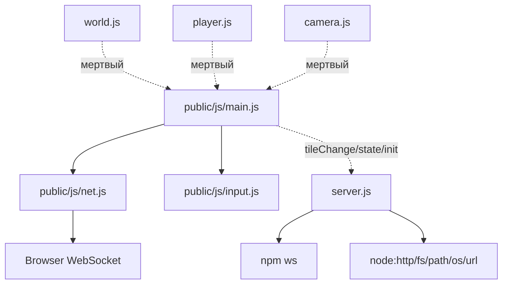

# Project Review: rpg-radmin (Co-op RPG + Radmin + WebSocket)

**Дата анализа:** 2026-09-18
**Проанализированная директория:** D:\Dev\ultra_hype_game_vith_hbs\game_with_hbs

## 1. Технологический стек

### Основной стек
- **Язык:** JavaScript (ES Modules, Node.js 18+)
- **Фреймворк:** Нет. Сервер — чистый `node:http`, клиент — чистые ES-модули + `<canvas>` 2D, без бандлера
- **База данных:** Нет. Всё состояние в памяти (`Map`: players, enemies, projectiles, wallHP)

### Ключевые библиотеки
| Библиотека | Версия | Назначение |
|------------|--------|------------|
| ws | ^8.18.0 | Единственная зависимость. WebSocket-сервер (`WebSocketServer`) |
| node:http / fs / path / os / url | stdlib | Раздача статики `public/`, LAN-IP детект, ESM `__dirname` |

### Инфраструктура
- **Контейнеризация:** Нет (`Dockerfile`, `docker-compose.yml` отсутствуют)
- **CI/CD:** Нет (`.github/workflows/` отсутствует)
- **Внешние сервисы:** Нет. Сеть — Radmin VPN / LAN, порт 3000, транспорт `ws://<ip>:3000` JSON

## 2. Архитектурный паттерн

**Тип:** Custom / Client-Server с Server-Authoritative симуляцией

**Описание:**
Монолит из 2 частей: толстый сервер `server.js` (658 строк: HTTP-статика + генерация карты + игровая логика + WS-протокол + тики 50мс/2500мс) и тонкий клиент `public/js/` (`main.js` рендер+лобби 410 строк, `net.js` WS-стейт 95 строк, `input.js` 18 строк). Сервер — источник правды для позиций, HP, врагов, снарядов, инвентаря, карты (`init` + `state` 20 Гц + `tileChange`). Клиент шлёт только намерения (`move dx/dy`, `attack/melee angle`), ничего не считает. Документация — `REAMDE.md` (sic, опечатка в имени; 416 строк, фактически README + спецификация протокола + правила для AI).

## 3. Структура модулей

### Карта модулей
```
game_with_hbs/
├── server.js             # HTTP + WS + карта + симуляция (658 строк)
├── update.py             # Питон-скрипт замены файлов целиком с .bak + --revert (упомянут в REAMDE п.14)
├── package.json          # type:module, scripts.start=node server.js, deps: ws
├── link.txt              # https://github.com/sviatbebebe/game_with_hbs
├── REAMDE.md             # Спецификация проекта (416 строк)
├── public/
│   ├── index.html        # Лобби + canvas + инлайн-CSS (83 строки)
│   ├── style.css         # МЁРТВЫЙ (30 строк, не подключен, стили инлайновые)
│   └── js/
│       ├── main.js       # Точка входа: лобби, камера, рендер тайлов/сущностей/инвентаря (410 строк)
│       ├── net.js        # WS-клиент, Map players/enemies/projectiles, _handle/_send (95 строк)
│       ├── input.js      # Клавиатура WASD/стрелки + мышь (18 строк)
│       ├── world.js      # МЁРТВЫЙ (54 строки, seeded 60x45 мир, сервер теперь генерит 200x150)
│       ├── player.js     # МЁРТВЫЙ (16 строк, client-authoritative движение, убрано)
│       └── camera.js     # МЁРТВЫЙ (5 строк, камера теперь инлайн в main.js)
```

### Детальное описание модулей

#### server.js (корень)
- **Назначение:** Всё серверное: генерация карты 200x150, `isSolid/blocksProjectile`, HTTP-статика с защитой `startsWith(root)`, WS `connection/message/close`, лобби (`setName/ready/start/backToLobby`), бой/лут, тики симуляции + респаун групп.
- **Размер:** 1 файл, 658 строк
- **Ключевые компоненты:**
  - `map[150][200], wallHP:Map, WALL_HP=50` — разрушаемые `T_STONE->T_FLOOR`
  - `ENEMY_TYPES {melee:300HP/220spd, ranged:80HP/180spd, wanderer:120HP/60→260spd}, ENEMY_AGGRO=350, MEMORY=6000`
  - `movePlayer, updateEnemies, updateProjectiles, spawnEnemyGroup, countGroups, meleeStrike, broadcast/lobbyState/resetGame/startGame`
  - `players/enemies/projectiles:Map, readySet:Set, hostId, gameState lobby|playing`
- **Зависимости:** Импортирует `node:http,fs,path,os,url, ws`

#### public/js/main.js
- **Назначение:** Склейка (единственное место создания экземпляров): лобби-DOM, камера lerp 0.15, рендер тайлов с hash-шумом, фигур врагов, игроков, снарядов, прицела, инвентаря, HUD; отправка `move` 20 Гц.
- **Размер:** 410 строк
- **Ключевые компоненты:** `Net, Input, camera{x,y}, mapData, myPlayer, drawTile/drawShape/renderLobby/showLobby/showGame/drawInventory/draw`
- **Зависимости:** Импортирует `./net.js, ./input.js`

#### public/js/net.js
- **Назначение:** WS-клиент: `connect(url)`, `_handle(init/lobby/started/join/leave/tileChange/state)`, `Object.assign` мерж `state`, `_send(setName/toggleReady/startGame/backToLobby/sendMove/sendAttack/sendMelee)`
- **Размер:** 95 строк, класс `Net`
- **Зависимости:** Только нативный `WebSocket`, ноль npm-зависимостей

#### public/js/input.js
- **Назначение:** `keys:Set<code>, mouse{x,y}, isDown(), getMove()->{dx,dy}`
- **Размер:** 18 строк, класс `Input`
- **Зависимости:** Только `window` events

#### Мёртвые модули (нарушение REAMDE п.52 — подлежат удалению)
- `world.js` — старый seeded мир 60x45, `isSolid/isBlocked/render`, нигде не импортируется
- `player.js` — старый `Player.update(dt,input,world)` 220 speed, нигде не импортируется
- `camera.js` — `Camera{follow,toScreen}`, нигде не импортируется
- `style.css` — старый `#menu` стиль, `index.html` его не линкует

## 4. Граф зависимостей



**Центральные модули:**
- `server.js` — импортируется никем, но от него зависят все рантайм-данные (карта, state 20 Гц)
- `net.js` — используется только `main.js`, но через него идёт весь трафик

**Циклические зависимости:**
- Не обнаружено (клиентские модули друг о друге не знают, правило соблюдено)

## 5. Точки входа

### Основная точка входа
- **Файл:** `server.js:644 server.listen(PORT 3000, 0.0.0.0)` + `lanIPs()` лог Radmin-IP
- **Описание:** `npm install && npm start` → HTTP раздача `public/` + WS апгрейд на том же порту. Игровые тики: `setInterval 50мс` симуляция+broadcast `state`, `setInterval 2500мс` додержать `GROUP_MIN=8` групп.

### API Endpoints (HTTP-статика, не REST)
| Метод | Путь | Обработчик | Назначение |
|-------|------|------------|------------|
| GET | `/` → `/index.html` | `server.js:101 http.createServer` | Лобби+canvas |
| GET | `/js/*.js`, `/*.css` | тот же, `MIME[.html/.js/.css/.png/.json]` | ES-модули без бандла, path-traversal guard `startsWith(root)` |

### WS протокол (JSON, докум. в REAMDE §4)
Клиент→сервер: `setName(name)`, `ready(toggle)`, `start(только host, lobby)`, `backToLobby(только host)`, `move(dx,dy)`, `attack(angle)`, `melee(angle)`.
Сервер→клиент: `init(id,gameState,hostId,map{tiles,tile,w,h},players,enemies,projectiles,items)`, `lobby(hostId,players[id,name,ready])`, `started`, `join(player)` (эмитится кодом? фактически не шлётся — см. проблемы), `leave(id)`, `state(players,enemies,projectiles)` 20 Гц, `tileChange(tx,ty,tile,hp?)`.

### CLI Commands
- `npm start` (`node server.js`), `PORT=3001 npm start` — единственный скрипт

## 6. Конфигурация и переменные окружения

**Обязательные переменные:**
- Нет. `PORT=process.env.PORT||3000` — всё.

**Опциональные переменные:**
- `PORT` — default 3000, клиент вычисляет WS-адрес из `location.host`, отдельное обновление не нужно

**Хардкод-константы (менять только с обновлением REAMDE §12):**
`TILE=32, MAP 200x150, PLAYER 14r/180spd/100HP, PROJ 500spd/5r/25dmg/1.5ttl/400dist, MELEE 60range/25dmg/300cd, WALL_HP 50, LOOT 0.35, GROUP 8-15 групп по 3-6, SPAWN_DIST 400, AGGRO 350`

## 7. Потенциальные проблемы и технический долг

### Критичные проблемы
- Нет. Секретов (`password/api_key/token`) и TODO/FIXME/HACK — `Grep` не нашёл (исключая `node_modules/`).

### Нарушения собственных правил REAMDE
- `server.js` 658 строк > лимита ~600 из §5.2 («пора бить на `server/`») — силовая точка рефакторинга.
- Мёртвые файлы `world.js/player.js/camera.js/style.css` + `*.bak` (`server.js.bak, main.js.bak, net.js.bak, index.html.bak`) — REAMDE §2 прямо требует удалить, захламляют `Glob` и путают новичков.
- Файл документации назван `REAMDE.md`, а не `README.md` — структура из §2 (`README.md`) не сходится, ссылки/авто-рендер GitHub ломаются.
- `join` из таблицы §4 сервером никогда не отправляется (`Grep join` — только обработка на клиенте `net.js:60`); новички будут ждать событие, которого нет.

### Логические / надёжностные замечания
- `wallHP:Map` не чистится в `resetGame()/backToLobby()` — HP повреждённых стен переживает рестарт, новая карта со старыми повреждениями.
- `init.map.tiles` — 200x150=30k чисел одним JSON (~100+KB) каждому подключающемуся; `state` — полные снапшоты players+enemies+projectiles 20 Гц всем — на слабом Radmin-канале джиттер.
- Нет валидации `move dx/dy` диапазона, `attack/melee angle` NaN-защита только `||0`; нет rate-limit — спам `attack` создаёт снаряды без CD (в отличие от `melee MELEE_CD=300`).
- `update.py` упомянут в REAMDE п.14 как обязательный способ правок (замена файлов целиком + `.bak` + `--revert`) — но сам `update.py` содержит вшитые копии `server.js/main.js` строк и расходится с текущими файлами; двойной источник правды.

### Рекомендации по рефакторингу
- Удалить мёртвые + `.bak`, переименовать `REAMDE.md→README.md` (или обновить §2).
- Разбить `server.js` по достижении лимита: `server/map.js, sim.js, net.js` — только по явному запросу владельца (§10 п.9).
- Чистить `wallHP` в `resetGame`, добавить `join` broadcast или убрать из доки, добавить CD на `attack`.

## 8. Выводы

**Общее состояние проекта:** Хорошее для учебного LAN-прототипа. Архитектура выдержана, протокол задокументирован, код читаем.

**Сильные стороны:**
- Ноль клиентских зависимостей, ноль сборки — запуск `npm install && npm start`.
- Server-authoritative движение/урон/лут/карта — защита от десинка, явно зафиксировано в REAMDE §4 п.2.
- Процедурная карта 30k тайлов + 3 типа врагов с aggro/памятью/leash + разрушаемые стены + инвентарь — много геймплея на 1.1k строк своего кода.
- Path-traversal guard, русскоязычные комментарии/секции `// ----------`, именования по §6 соблюдены.

**Области для улучшения:**
- Гигиена репо (мёртвые файлы, `.bak`, имя README) и переросший `server.js`.
- Сетевой масштаб: дельта-`state`/interest-management вместо полных снапшотов при росте онлайна.

**Готовность к расширению:**
Высокая для пунктов из §8 (крафт→строительство→боссы): новый враг = запись в `ENEMY_TYPES` + форма в `main.js draw()`; новый предмет = запись в `ITEMS` (клиент рисует сам). Ограничение — весь гейм-стейт в памяти, рестарт сервера вайпает мир.
